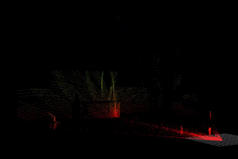
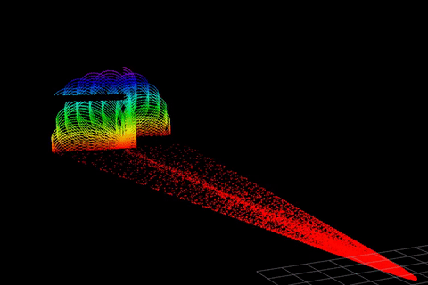
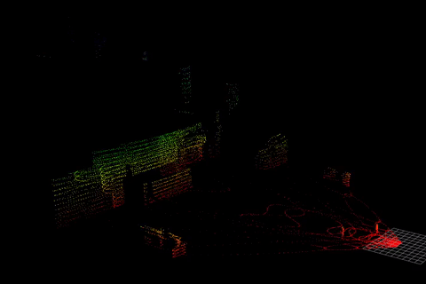

# Livox Laser Simulation
A package to provide plug-in for [Livox Series LiDAR](https://www.livoxtech.com).

## Requirements
- ROS(=Melodic/Noetic)
- Gazebo (= 11)

## Results
- avia


- mid40


- mid70


- tele


- horizon



## Branchs


### master(gazebo11)
- enviroment: ROS melodic + gazebo11
- pointcloud type: sensor_msg::pointcloud2(pcl::Pointcloud\<pcl::PointXYZ\>)

## Dependence

- [livox_ros_driver](https://github.com/Livox-SDK/livox_ros_driver)

or

- [livox_ros_driver_for_R2LIVE](https://github.com/ziv-lin/livox_ros_driver_for_R2LIVE)


## Usage

> If you use gazebo 9. The gazebo-9 version is maintained by [jp-ipu](https://github.com/jp-ipu).

Before you write your urdf file by using this plugin, catkin_make/catkin build is needed.

A simple demo is shown in livox_simulation.launch

Run 
```
    roslauch livox_laser_simulation livox_simulation.launch
```
to see.

Change sensor by change the following lines in the robot.xacro into another xacro file.
```xml
  <xacro:include filename="$(find livox_laser_simulation)/urdf/livox_horizon.xacro"/>
  <Livox_Horizon name="livox" visualize="true" publish_pointcloud_type="2"/>
```

- avia.csv
- horizon.csv
- mid40.csv
- mid70.csv
- tele.csv

## Parameters(example by avia)

- laser_min_range: 0.1  // min detection range
- laser_max_range: 200.0  // max detection range
- horizontal_fov: 70.4   //°
- vertical_fov: 77.2    //°
- ros_topic: scan // topic in ros
- samples: 24000  // number of points in each scan loop
- downsample: 1 // we can increment this para to decrease the consumption
- publish_pointcloud_type: 0 // 0 for sensor_msgs::PointCloud, 1 for sensor_msgs::Pointcloud2(PointXYZ), 2 for sensor_msgs::PointCloud2(LivoxPointXyzrtl) 3 for livox_ros_driver::CustomMsg.


> This repository is forked from [Livox-SDK/livox_laser_simulation](https://github.com/Livox-SDK/livox_laser_simulation) and [lvfengchi/livox_laser_simulation](https://github.com/lvfengchi/livox_laser_simulation), I just made some minor adjustments.

